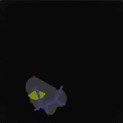
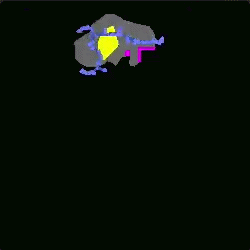
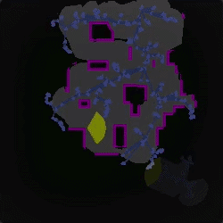
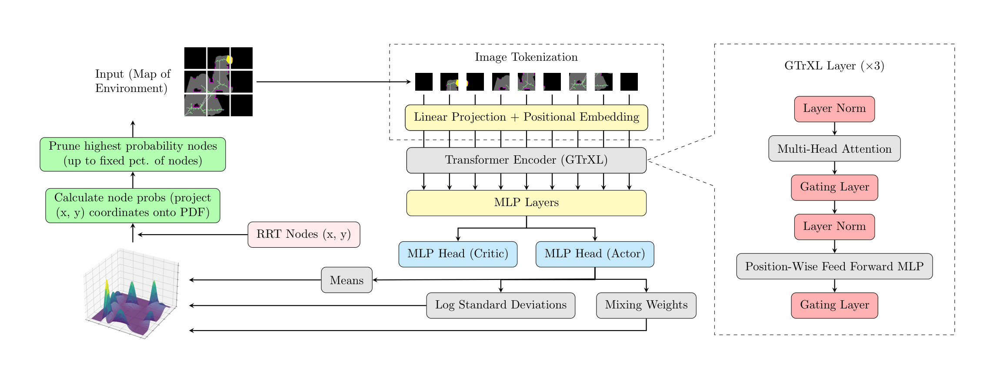

## Learning-Based Sparsification of Dynamic Graphs in Robotic Exploration Algorithms

<a href="https://arxiv.org/abs"></a>

<table>
  <tr>
    <td align="center">
      
    </td>
    <td align="center">
      
    </td>
    <td align="center">
      
    </td>
  </tr>
  <tr>
    <td align="center"><b>Exploration without pruning.</b></td>
    <td align="center"><b>Exploration under random pruning.</b></td>
    <td align="center"><b>Exploration under learned pruning.</b></td>
  </tr>
</table>

### Overview

This project presents a transformer-based framework trained with Proximal Policy Optimization (PPO) to prune dynamic graphs used in autonomous robotic exploration algorithms. Despite performance bottlenecks, our approach maintains important structural features of the exploration graph and improves the consistency of exploration across highly varied environments while reducing the size of the exploration graph by 96%.



#### Project structure

- `pysparse/py/` -- implementation of reinforcement learning (RL) framework
- `trainer/` -- RL training pipeline
- `sim/` -- simulation environment used for all experiments
- `rrt_fast/` -- implementation of the RRT-based exploration algorithm used in experiments
- `rrt_lib/` -- implementation of the RRT algorithm
- `tensorviz/` -- utility for visualizing tensors as colorful heatmaps in the terminal

Additionally, the code for experiments introducing trigonometric noise to the GMM probabilities can be found in the [`trig_noise` branch](https://github.com/avs-origami/graphsparse/tree/trig_noise?tab=readme-ov-file).

### Setup and training

#### Requirements
- Rust 1.86.0 (recommended to use [rustup](https://rust-lang.org/tools/install/))
- Python 3.14
- GCC 15.2.1
- CUDA 13.1

#### Setup
Create and activate a python virtualenv at `.venv`:
```bash
python -m venv .venv  # must either use this location or change it in pysparse.sh
source .venv/bin/activate
```

Install required python packages:
```bash
pip install -r requirements.txt
```

#### Training
All hyperparameters are configured by default to the values used for experiments presented in the paper. Run the following to begin training:
```bash
cargo run --release -p trainer
```

Hyperparameters and other options can be configured on the CLI. Run the following to see all options:
```
cargo run --release -p trainer -- --help
```

Any warnings produced by the compiler can be ignored safely.

## Other notes

This code was primarily developed and tested on Arch Linux, so some system software used in development (e.g. Python, GCC, CUDA, etc) may be a newer version than on other Linux operating systems. If this is the case, the `requirements.txt` may not work properly, and it might instead be necessary to install the packages manually.

## Citation

```
@misc{sastry2026graphsparse,
  title={Learning-Based Sparsification of Dynamic Graphs in Robotic Exploration Algorithms},
  author={Sastry, Adithya V. and Poudel, Bibek and Li, Weizi},
  year={2026},
  eprint={},
  archivePrefix={arXiv},
  primaryClass={cs.LG},
  url={https://arxiv.org/abs/},
}
